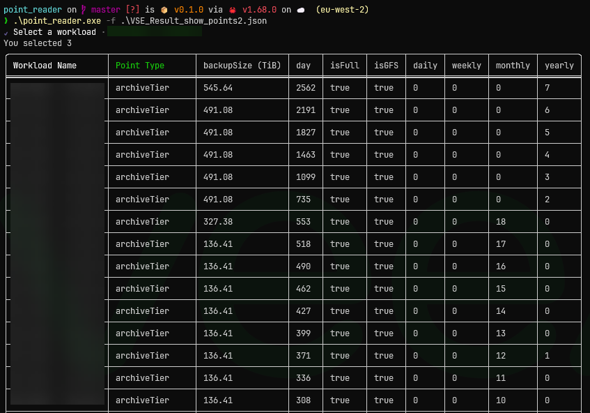

# Point Reader

This is a simple application that can takes a VSE (official) export JSON file with the points enabled and display them in a table and optionally to a CSV file.

Enabling this feature in the new VSE tool is not public information, you will need to discuss it with your local Solutions Architect.

The VSE tool is being updated regularly so expect breaking changes to this tool.



## Installation

### Install via Cargo

1. Install [Rust](https://www.rust-lang.org/tools/install)
2. Run:

```
cargo install point_reader
```

Uninstall:

```
cargo uninstall point_reader
```

### Build from source

1. Clone the repository
2. Install Rust
3. Run `cargo install --path .`

### Build using Docker

1. [Install Docker](https://docs.docker.com/engine/install/)
2. Clone the repository `git clone https://github.com/shapedthought/point_reader.git`
3. `cd point_reader`
4. build the image `docker build -t point_reader .`
5. Run using the following command:

```
docker run -it --rm -v ${PWD}:/tmp point_reader /bin/bash

# ./point_reader -f /tmp/VSE_export.csv -t pc -s /tmp/workload1_points.csv
```

This uses a bind mount as an example, you can use any method you like to get the files in/out of the container.

## Usage

CLI:

```
Point Reader

Usage: point_reader.exe [OPTIONS] --file <FILE>

Options:
  -f, --file <FILE>            Path to file
  -t, --tiers <TIERS>          [default: pca]
  -s, --save-file <SAVE_FILE>
  -w, --workload <WORKLOAD>
  -h, --help                   Print help
  -V, --version                Print version
```

## Examples

Run tool without outputting to CSV:

```
point_reader --file VSE_Exports.json
```

Run tool and output to CSV:

```
point_reader --file VSE_Exports.json --save-file points_data.csv
```

The .csv is option and will be added if not provided

To run the tool and show only specific tiers, use the -t flag:

```
point_reader --file VSE_Exports.json --tiers pc
```

The tiers are:

- p = Performance Tier
- c = Capacity Tier
- a = Archive Tier

If you know the workload name you can run the tool non-interactively with the --workload flag:

```
point_reader --file VSE_Exports.json --workload "Workload 1"
```
